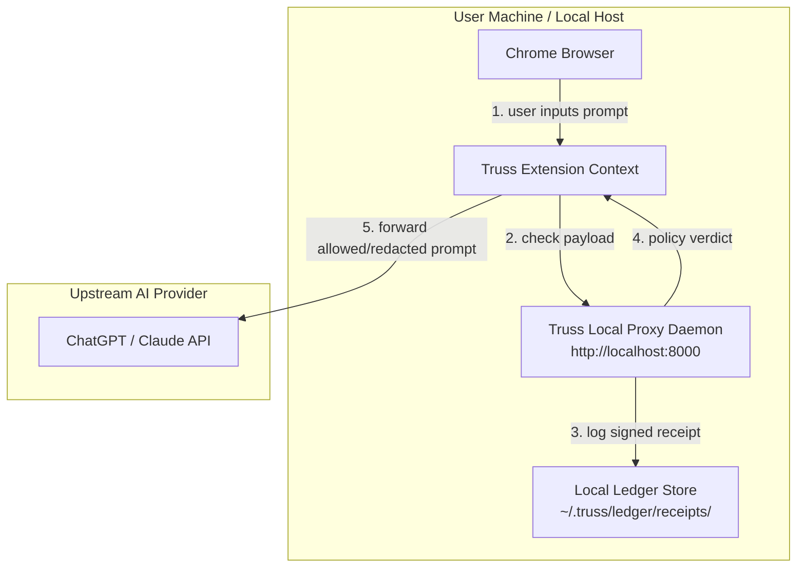
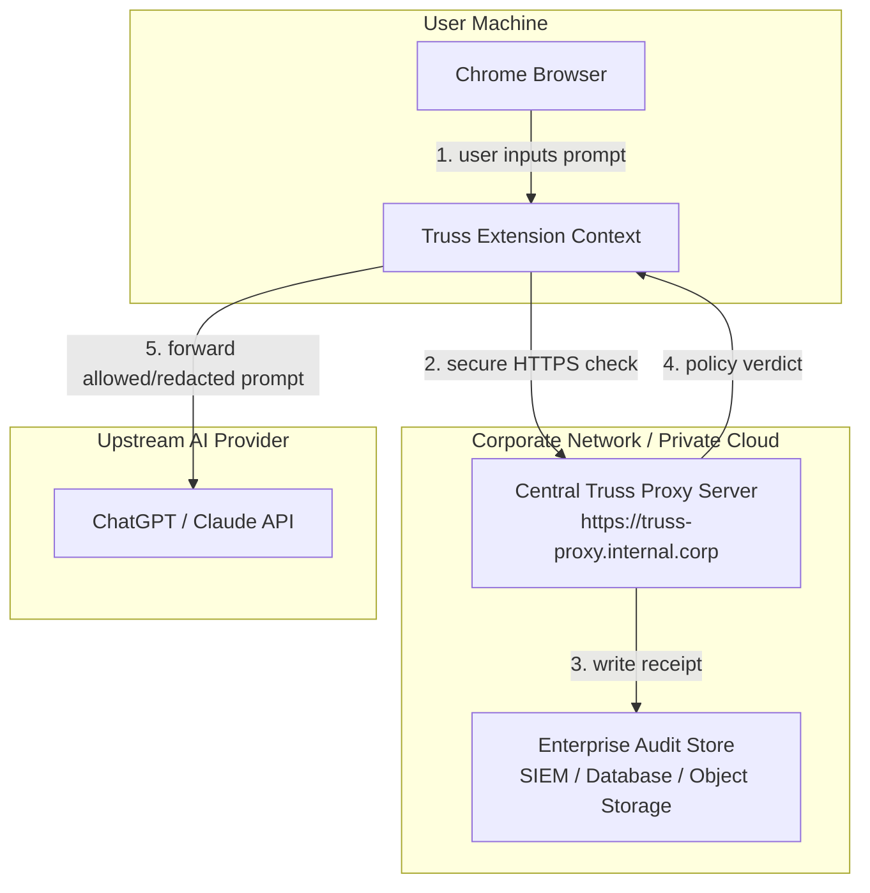

# Truss Extension Deployment Architectures

This document details the deployment patterns for the Truss browser extension and FastAPI proxy. It explains how Truss intercepts web client traffic on platforms like ChatGPT and Claude, the underlying network topology, and the technical requirements for enterprise environments.

---

## Architectural Models

Truss supports two deployment models depending on your security, privacy, and infrastructure requirements:

1. **Edge Model (Local Agent):** Run the proxy daemon locally on each user's computer.
2. **Centralized Model (Enterprise Proxy):** Run a single proxy on a secure internal corporate server and point multiple remote extensions to it.

---

### 1. Edge Model (Local Agent)

In the Edge Model, every user computer runs the Truss proxy daemon as a background service or in a local Docker container. The Chrome extension communicates directly with `localhost:8000`.

#### Topology Diagram



#### Why Choose the Edge Model?
* **Zero Latency Overhead:** Intercepting interactive user prompts requires low overhead. Running the proxy on the local loopback interface (`localhost:8000`) keeps API round-trips under 2 milliseconds.
* **Local Data Custody:** Raw prompt contents, secrets, and cryptographic ledger receipts are written directly to the user's home folder (`~/.truss/`). No raw data leaves the machine until authorized.
* **Offline Governance:** Policies apply and block/redact rules remain fully functional even when the user is disconnected from the corporate network or VPN.
* **SIEM Integration:** A local log forwarder (such as Splunk Universal Forwarder or Rsyslog) can monitor `~/.truss/ledger/receipts/` and securely forward audit records to a central SIEM.

---

### 2. Centralized Model (Enterprise Proxy)

In the Centralized Model, individual user machines only install the Chrome extension. The Truss proxy runs on a centralized, secure server within your private cloud or virtual private network (e.g., `https://truss-proxy.internal.corp`).

#### Topology Diagram



#### Why Choose the Centralized Model?
* **Zero-Install Client:** No daemon or runtime dependencies need to be distributed or updated on employee laptops. You only distribute the unpacked Chrome extension via Enterprise MDM (such as Jamf or Google Workspace Admin).
* **Consolidated Audit Trial:** All ledger receipts are written directly to the central server's local disk, a shared volume, or database, eliminating the need to manage distributed log collectors.
* **Instant Policy Synchronization:** Updating policy YAML files on the central server instantly applies the new compliance rules to all connected employees.

---

## Execution Sequence

The sequence diagram below maps how the Chrome extension's dual-world message passing layer interacts with the proxy to evaluate, ledger, and govern prompts before they are transmitted upstream.

```mermaid
sequenceDiagram
    autonumber
    actor User as User (Browser)
    participant Extension as Truss Extension (Isolated Context)
    participant Proxy as Truss Proxy (Local/Remote)
    participant LLM as Upstream LLM (OpenAI/Anthropic)

    User->{plus}{plus}Extension: Submits prompt on Web UI
    rect rgb(240, 248, 255)
        note right of Extension: Intercepts fetch call
        Extension->{plus}Proxy: POST /v1/extension/check
        Proxy->Proxy: Classify content & evaluate policy
        Proxy->Proxy: Write signed JSON receipt to ledger
        Proxy--{minus}Extension: Return verdict (allow / block / redact) + mutated text
    end
    alt Verdict is Blocked
        Extension--User: Stop request and render block warning UI
    else Verdict is Allowed / Redacted
        Extension->{plus}LLM: Forward allowed or redacted prompt upstream
        LLM--{minus}Extension: Return stream / response
        Extension--{minus}User: Render response on Web UI
    end
```

---

## Technical Requirements & Constraints

Deploying the centralized pattern requires addressing several browser security controls:

### 1. Chrome Manifest V3 Host Permissions
Chrome blocks requests from extension scripts to external servers unless declared in the extension manifest.
* To point to a custom enterprise proxy, the origin must be included in `manifest.json`:
  ```json
  "host_permissions": [
    "https://truss-proxy.internal.corp/*"
  ]
  ```
* Alternatively, the extension popup UI can request host permissions dynamically using the Chrome permissions API:
  ```javascript
  chrome.permissions.request({
    origins: ['https://truss-proxy.internal.corp/']
  });
  ```

### 2. TLS and Enterprise Certificate Trust
When using an HTTPS endpoint like `https://truss-proxy.internal.corp`, the SSL/TLS certificate **must be trusted by the client browser**.
* If you are using an internal Private CA or self-signed certificate, the CA root certificate must be distributed to each employee machine's system trust store (e.g., via Jamf, Kanon, or Active Directory Group Policy).
* Untrusted certificates cause Chrome to reject the background fetch, which triggers Truss's fail-closed security mode.

### 3. Cross-Origin Resource Sharing (CORS)
When the extension issues a fetch request, Chrome transmits the origin of the webpage where the user is typing (such as `Origin: https://chatgpt.com` or `Origin: https://claude.ai`).
* The central Truss server must handle these cross-origin preflight requests correctly.
* Truss’s FastAPI proxy includes pre-configured permissive CORS middleware (`allow_origins=["*"]`) which automatically accepts requests and returns appropriate headers.

### 4. Network Fail-Closed Security (Privacy Safeguard)
If a remote employee is disconnected from the corporate VPN or network, the central proxy `https://truss-proxy.internal.corp` will become unreachable.
* **Fail-Closed Behavior:** The extension will instantly intercept prompt attempts, detect that the proxy is unreachable, and block the submission entirely—rendering a **🛡️ Truss Proxy Unreachable** full-screen warning.
* This guarantees that raw corporate prompts never accidentally "fail open" and bypass your policy checks when employees are off-network.

---

## Chrome Extension Distribution Methods

Publishing the extension publicly on the consumer Chrome Web Store is **not required**. To deploy the extension securely across an organization, select one of the following official distribution patterns:

### 1. Enterprise Force-Install (MDM Managed)
For fully managed corporate environments, IT administrators can silently deploy and force-enable the extension via endpoint management tools (e.g., Jamf, Microsoft Intune, Google Workspace Admin Console, or Active Directory Group Policy).
* **Mechanism:** Administrators push an enterprise policy configuration setting the `ExtensionInstallForcelist` parameter. This specifies the extension ID and an update URL pointing to an internally hosted secure XML file (`updates.xml`) and pre-packaged `.crx` file.
* **Security Posture:** Users cannot disable or uninstall the extension, the installation happens silently in the background, and all updates are pulled automatically from your secure internal hosting server.

### 2. Private or Unlisted Web Store Publishing
If you prefer Chrome Web Store's automatic background updating infrastructure but want to keep the extension hidden from the public eye, publish under one of these developer-console visibility states:
* **Private / Domain-Restricted:** The extension is only visible and installable for users signed into Chrome with their official company Google Account (e.g., `@yourcompany.com`).
* **Unlisted:** The extension does not appear in store search results or category lists. It is only accessible to users who are given the direct URL link.
* **Security Posture:** Simplifies the update cycle since Google handles binary distribution, while preventing external discovery or installation by the general public.

### 3. Local Developer Mode (Load Unpacked)
For prototyping, local audits, or restricted testing circles:
* **Mechanism:** Open `chrome://extensions/` in Chrome, toggle **Developer mode** in the top-right corner, and click **Load unpacked** to load the `extension/` directory directly from your local repository.
* **Security Posture:** Best suited for active development and initial system testing, requiring direct filesystem access.
